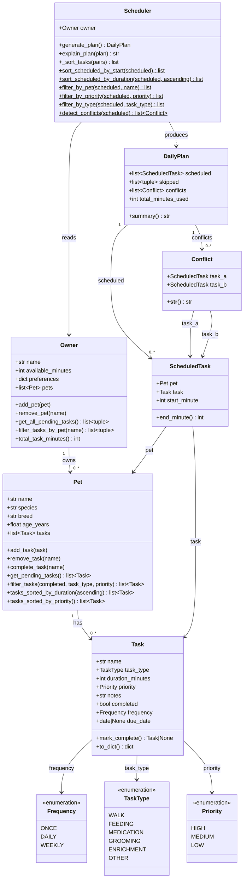

# PawPal+ — Final UML Class Diagram

Paste the Mermaid code below into https://mermaid.live to render the diagram.

## Changes from initial draft (Phase 1 → final)

| What changed | Why |
|---|---|
| `Task` gained `frequency: Frequency` and `due_date: date` | Recurring task support added in Phase 3 |
| `Task.mark_complete()` returns `Task \| None` instead of `None` | Returns a renewal instance for daily/weekly tasks |
| `Pet` gained `complete_task()`, `filter_tasks()`, `tasks_sorted_by_*()` | Sorting and filtering layer added in Phase 3 |
| `Owner` gained `get_all_pending_tasks()` and `filter_tasks_by_pet()` | Scheduler now queries Owner directly rather than accepting a separate pet list |
| `Scheduler.__init__` takes only `Owner` (not `Owner + Pet`) | Supports multi-pet owners naturally |
| `ScheduledTask` gained `pet: Pet` field | Needed to identify which pet owns each block in the schedule |
| `Conflict` dataclass added | Conflict detection result type, Phase 3 |
| `DailyPlan.conflicts` field added | Populated by `generate_plan()` after scheduling |
| All `Scheduler.sort_*/filter_*` methods are `@staticmethod` | They operate on plain lists and have no dependency on `self.owner` |
